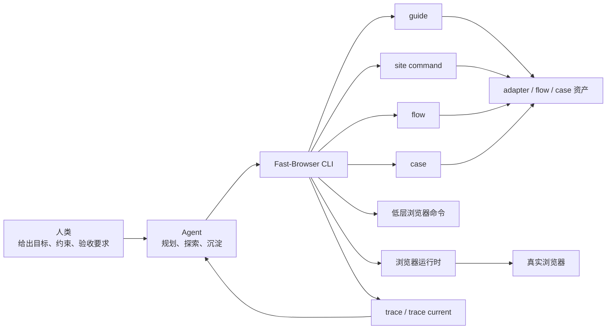
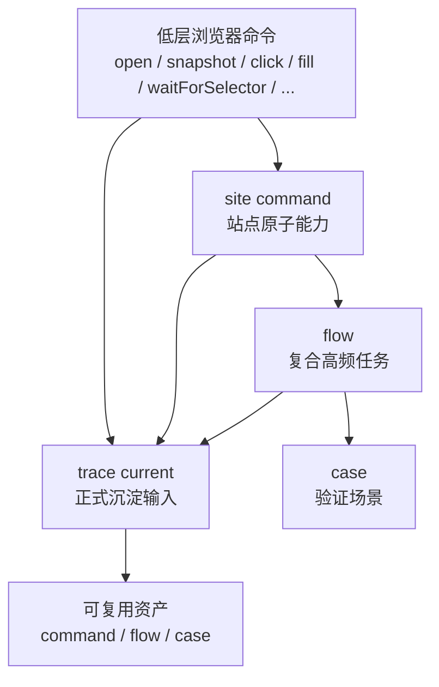
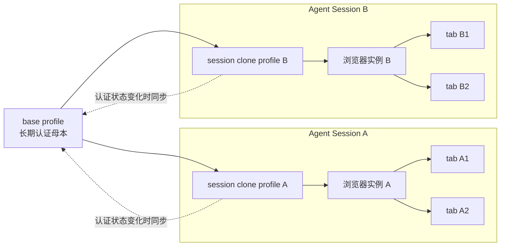

# Fast-Browser PRD

版本：v1.5
日期：2026-03-28
状态：持续演进

## 1. 产品目标

Fast-Browser 的目标不是做一套给人类测试工程师手写脚本的工具，而是给 AI Agent 一套统一、稳定、可复用的浏览器与站点能力入口。

它要解决的问题是：
- Agent 虽然可以操作真实网页，但如果只有低层命令，速度慢、稳定性差、复用弱
- 一次成功操作如果不能沉淀成长期资产，下次仍然会重复 `snapshot`、`eval`、找 selector
- 登录态、会话、流程复用和验证场景，需要统一到同一个 CLI 里

## 2. 设计原则

- 低层命令负责探索、调试、补缺口
- `command` 负责原子站点能力
- `flow` 负责复合高频任务
- `case` 负责验证语义
- `guide` 负责冷启动骨架，不负责自动学习
- `trace current` 是沉淀 `command / flow / case` 的正式输入

## 3. 分层架构

### 3.0 总览交互图



### 3.1 低层浏览器命令

这一层直接控制真实浏览器，当前能力包括：
- 打开与导航：`open`、`reload`、`goBack`、`goForward`
- 观察：`snapshot`、`getUrl`、`getTitle`、`console`、`network`、`performance`
- 交互：`click`、`fill`、`type`、`press`、`hover`、`scroll`
- 等待：`wait`、`waitForSelector`
- 环境：`cookies`、`localStorage`、`sessionStorage`
- 页面辅助：`gate`、`collect`、`extract-blocks`
- 标签页：`tab list/new/switch/close`

### 3.2 站点命令

通过 `site <adapter>/<command>` 调用站点原子能力。

这层应该承载：
- 搜索
- 打开详情
- 打开后台页面
- 提交表单
- 打开订单、作品、资料页

`command` 的正式沉淀入口应包括：
- `command save --from-trace`：从 `trace current` 生成 command draft
- `command materialize --draft`：基于 draft 生成 `manifest.json`、`commands/*.ts`、必要时 `index.ts` 的补丁建议

正式 adapter 资产始终落到 `src/adapters/<site>/...`，而运行期 draft 只作为中间沉淀物存在。

### 3.3 `flow`

`flow` 是高频复合任务。

正式 DSL 只支持：
- `site`
- builtin `open`
- builtin `wait`
- builtin `waitForSelector`
- success assertions

`flow` 不承载：
- `snapshot`
- `eval`
- `click`
- `fill`
- `type`
- `press`
- 条件分支
- 循环
- 并行
- 回滚

### 3.4 `case`

`case` 是验证场景。

`case` 只编排 `flow`，不直接承载 DOM 级脚本。

### 3.5 命令分层架构图



## 4. 运行时与沉淀模型

### 4.1 低层动作的目标

低层命令的目标是尽可能接近真实业务交互，而不是只做一次机械 DOM 动作。

系统应尽量保证：
- 输入类动作不仅修改元素值，还能让页面感知到输入完成
- 点击类动作不仅触发一次事件，还尽量等待页面进入稳定状态
- 等待类动作优先依赖页面状态，而不是固定时间

### 4.2 `snapshot/ref` 的目标

`snapshot` 与 `@eN` 的目标是服务探索，而不是成为长期资产本身。

系统应尽量提供：
- 语义优先、结构兜底的定位信息
- 更稳定的 selector 候选
- ref 与页面语义之间的可追溯关系

### 4.3 `trace` 的目标

`trace latest` 保留原始事件，用于调试。

`trace current` 提供沉淀视图，用于：
- 提炼 `command`
- 提炼 `flow`
- 提炼 `case`

Agent 不应主要依赖聊天上下文来总结资产，而应以 `trace current --json` 作为正式输入。

### 4.4 `guide` 的边界

`guide` 负责：
- 页面分析
- 参数推断
- 生成 adapter 骨架
- 生成 starter flow

`guide` 不负责：
- 自动学习
- 自动产生成熟 adapter
- 从原始探索自动沉淀稳定 `command / flow / case`

## 5. Agent 使用流程

### 5.1 已有站点能力时

优先顺序：
1. `case`
2. `flow`
3. `site`
4. 低层命令

### 5.2 新站点时

流程：
1. `fast-browser workspace --json`
2. 选择稳定入口路由
3. `guide inspect`
4. `guide plan`
5. `guide scaffold`
6. 完成一次真实任务
7. `trace current --json`
8. 沉淀 `command / flow / case`

### 5.3 能力沉淀规则

- 稳定、原子、站点特定动作 -> `command`
- 多步、高频、可命名目标 -> `flow`
- 验证场景 -> `case`

其中 `command` 的沉淀应遵循两段式路径：
1. 基于 `trace current --json` 执行 `command save --from-trace`
2. 必要时执行 `command materialize --draft` 获取落地补丁建议
3. 最终由 Agent 把正式代码落到 adapter 目录

## 6. 已接受的系统边界

以下是产品边界，不是偏差：
- 低层动作不保证 100% 等于业务动作成功
- `snapshot/ref` 不承诺在复杂 SPA 长流程里永不漂移
- `guide` 只是骨架器，不是成熟 adapter 生成器
- `command` 的沉淀会比 `flow/case` 更依赖代码编辑

## 7. 目录与状态

默认 workspace：

```text
<fast-browser-cli-root>
```

默认 adapter 资产位置：

```text
<workspace>/src/adapters/<site>/
```

默认浏览器认证母本：

```text
%USERPROFILE%\.fast-browser\chrome-profile
```

默认浏览器元状态目录：

```text
%USERPROFILE%\.fast-browser\sessions
```

## 7.1 浏览器 Profile 与 Session 架构原则

Fast-Browser 的浏览器隔离正式采用：
- `base profile`：用户级长期保存的认证母本
- `session clone profile`：每个 Agent session 的独立运行时副本
- `tab`：只负责单个 session 内部的多页面切换，不承担多 Agent 隔离职责

### 示例图



### 为什么不采用“同 profile + Tab ID 隔离”

虽然共享一个 profile 并只靠 Tab ID 做多 Agent 隔离更轻，但它在 Fast-Browser 这种本地 CLI 场景下有三个核心问题：
- 状态污染范围太大：tab、storage、service worker、当前页、snapshot ref 都可能互相影响
- 维护复杂度高：需要长期维护“当前页属于谁”“哪个 tab 被谁占用”“空白页是否应回收”等规则
- 问题定位复杂度高：一旦串线，难以快速判断是 tab 归属、浏览器状态还是站点运行态导致

因此，Fast-Browser 选择用更清晰的隔离边界换取更低的排障成本。

### 正式原则

1. `base profile` 只承担认证母本
   它不直接承载并发任务上下文，也不应该被多个 Agent session 同时作为活跃运行 profile 使用。

2. `session clone profile` 是运行时缓存，不是长期资产
   它服务于当前 session 的浏览器实例、当前 tab、当前页面状态和当前 ref。

3. 认证状态同步不依赖“session 结束”
   因为 Agent session 往往只有归档、删除或长期闲置，没有稳定的“结束事件”。因此认证状态应以“登录态变化”或显式同步为触发条件回写到 `base profile`。

4. clone 生命周期采用 `active / idle / expired`
   clone 不应因为单条命令结束就被清理，也不应永久保留。

5. clone 清理后只保证恢复登录态
   后续新 session 应能从 `base profile` 恢复认证状态，但不承诺恢复之前的 tab、页面上下文、snapshot ref。

## 8. 下一阶段方向

下一阶段不再优先追求新命令数量，而优先继续增强：

1. 低层动作的业务语义稳定性
2. `snapshot/ref` 的长期稳定性
3. 页面成功信号的统一模型
4. `trace -> command/flow/case` 的 CLI 级约束
5. `guide` 的骨架质量
